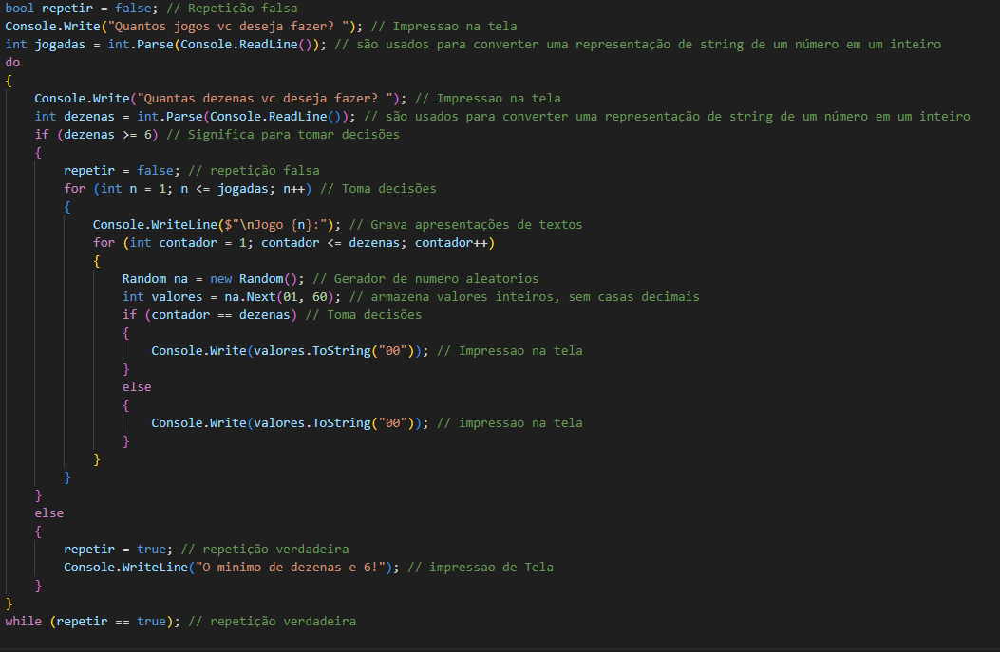

## Mega Sena
+ Para começar, Nesse codigo Foi ultilizado a linguagem C#(Csharp)

### Etapas Implementadas
>+ I. Primeiro perguntamos ao usuario quantos jogos e dezenas o usuario deseja fazer;
>+ II. Se o número de dezenas for 6 ou mais, o programa continua, caso contrário, ele avisa que o mínimo é 6 e repete o pedido.
> dessa forma fica o codigo em execução:
>

+ III. O codigo funciona a partir do **Randow** que gera numeros automaticos, ele e um codigo execencial para geração de codigos
para numeros de loteria;
+ IV. Dentro deste loop de codigos, uma nova instância de Random é criada para gerar números aleatórios entre 1 e 59;
+ V. Para cada jogo, outro loop **for** intera de 1 até o número de dezenas **(dezenas)**
+ VI. Como seria o codigo em proceso:

## Backlog
+ I.  O código não possui verificação para garantir que a entrada do usuário seja um número válido. Isso pode causar exceções se o usuário inserir um valor inválido.
+ II.  é criado dentro do loop. Isso pode resultar em números aleatórios repetidos, pois o Random usa o relógio do sistema como semente. Uma melhor prática seria criar uma única instância de Random fora dos loop;
+ III. Nesse codigo, foi adicionado um limite necessario de dezenas ele pode ser adicionado mais numeros;
+ IV. Todos os números são impressos na mesma linha, sem separação, o que pode dificultar a leitura. Seria útil adicionar espaços ou vírgulas entre os números

## Conclusão
O código é uma boa base para a geração de números de loteria, mas poderia ser melhorado em termos de manuseio de erros, 
separação de números e a forma como o Random é instanciado.  