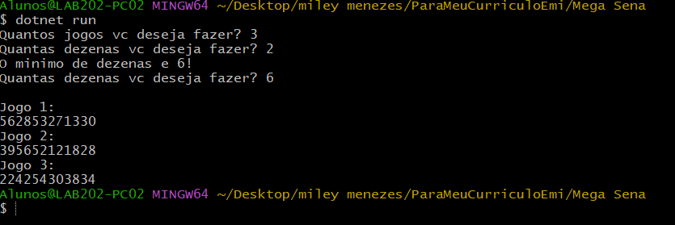

## Mega Sena
+ Para começar, Nesse codigo Foi ultilizado a linguagem C#(Csharp)

### Etapas Implementadas
+ I. Primeiro perguntamos ao usuario quantos jogos e dezenas o usuario deseja fazer;
+ II. Se o número de dezenas for 6 ou mais, o programa continua, caso contrário, ele avisa que o mínimo é 6 e repete o pedido.
 dessa forma fica o codigo em execução:

+ III. O codigo funciona a partir do **Randow** que gera numeros automaticos, ele e um codigo execencial para geração de codigos
para numeros de loteria;
+ IV. Dentro deste loop de codigos, uma nova instância de Random é criada para gerar números aleatórios entre 1 e 59;
+ V. 